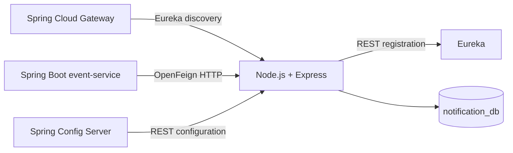

# Notification Service

CampConnect's collaborative notification microservice, implemented with
Node.js, Express, Mongoose, and MongoDB.

## Features

- Persisted MongoDB CRUD
- Recipient, event, type, and read-state filters
- Unread counts and bulk read-state updates
- DTO-style request validation and structured API errors
- OpenAPI documentation and Swagger UI
- Spring Config Server property loading
- Eureka REST registration and heartbeats
- Compatibility with the Spring Boot Event Feign client and API Gateway

## Architecture



The service keeps the API paths and JSON contract of the previous Spring
implementation. The frontend, Gateway routes, and Event Feign client do not
need to change.

## Run Locally

```bash
npm install
npm test
npm start
```

MongoDB defaults to `mongodb://localhost:27018/notification_db`. Start MongoDB
and the service together with:

```bash
docker compose up --build
```

## Endpoints

| Method | Endpoint | Purpose |
| --- | --- | --- |
| `POST` | `/notifications` | Create a persisted notification |
| `GET` | `/notifications` | List and filter notifications |
| `GET` | `/notifications/{id}` | Get one notification |
| `PUT` | `/notifications/{id}` | Update notification content |
| `DELETE` | `/notifications/{id}` | Delete a notification |
| `PATCH` | `/notifications/{id}/read` | Mark one as read |
| `PATCH` | `/notifications/recipient/{recipientId}/read-all` | Mark all as read |
| `GET` | `/notifications/recipient/{recipientId}/unread-count` | Count unread |

List filters are `recipientId`, `eventId`, `read`, and `type`.

- Swagger UI: `http://localhost:8082/swagger-ui.html`
- OpenAPI JSON: `http://localhost:8082/v3/api-docs`
- Health: `http://localhost:8082/actuator/health`
- Info: `http://localhost:8082/actuator/info`

## Configuration

| Environment variable | Default |
| --- | --- |
| `SERVER_PORT` | Config Server value or `8082` |
| `MONGODB_URI` | Config Server value or local MongoDB |
| `CONFIG_SERVER_IMPORT` | `optional:configserver:http://localhost:8099` |
| `CONFIG_SERVER_FAIL_FAST` | `false` |
| `EUREKA_URL` | Config Server value or local Eureka |
| `EUREKA_INSTANCE_HOSTNAME` | Machine or container hostname |
| `EUREKA_INSTANCE_IP` | DNS-resolved hostname |
| `EUREKA_ENABLED` | `true` |
| `EUREKA_FAIL_FAST` | `false` |

The Node adapter reads the existing Spring property names from
`/notification-service/default`, including `server.port`,
`spring.data.mongodb.uri`, Eureka, actuator, and Springdoc paths. Environment
variables take priority.

## Validation And Errors

Create and update requests require:

- `recipientId`: nonblank, maximum 120 characters
- `type`: one of the documented notification types
- `title`: nonblank, maximum 160 characters
- `message`: nonblank, maximum 2,000 characters

Errors preserve the shared response format:

```json
{
  "timestamp": "2026-06-10T10:30:00.000",
  "status": 400,
  "error": "Bad Request",
  "message": "Request validation failed",
  "path": "/notifications",
  "validationErrors": {
    "recipientId": "must not be blank"
  }
}
```

API security remains centralized in the Gateway through Keycloak roles.
